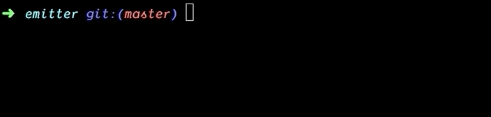

# klap :clap:

a zero config, zero dependency bundler for tiny javascript packages.

<!-- prettier-ignore-start -->
[](https://travis-ci.org/osdevisnot/klap)


<!-- ALL-CONTRIBUTORS-BADGE:START - Do not remove or modify this section -->
[](#contributors-)
<!-- ALL-CONTRIBUTORS-BADGE:END -->
<!-- prettier-ignore-end -->

<table border="0">
<tr><td>

</td><td>

</td></tr>
</table>

## :sparkles: Features

- :tada: **zero config**: bundle your library using only a `package.json`
- :boom: **zero config**: typescript support (just rename `*.js` to `*.ts`)
- :star2: **zero config**: code transforms using babel macros
- :rainbow: **zero config**: code generation using babel plugin codegen
- :rocket: **zero dependency**: uses [gcc-style bundling](https://www.npmjs.com/package/@zeit/ncc).
- :octopus: creates **tiny bundles** for multiple output formats `cjs`, `esm` and `umd`
- :fire: **Modern JS** syntax with class properties, async/await, and generators
- :zap: Built in Minification and Gzip Size Tracking
- :cyclone: Built in development server for quick prototyping.
- :confetti_ball: Supports **`react`**, **`styled-components`** and **`emotion`** out of the box.

### :muscle: Powered By

- [rollup](https://rollupjs.org) - Next-generation ES module bundler
- [babel](https://babeljs.io) - The compiler for next generation JavaScript

## :plate_with_cutlery: Usage

First, initialize your project using `klap init`:

```bash
npx klap init
```

**Prefer Typescript ?** initialize using `ts` argument:

```bash
npx klap init ts
```

**Want to use JSX with Typescript?** `init` using `tsx` argument:

```bash
npx klap init tsx
```

The `init` command will create a minimal `package.json` with `source`, `main`, `module` and `browser` entries and the `build`, `watch` and `start` scripts.

```jsonc
{
  "name": "...",
  "version": "0.0.0",
  "files": [ "dist" ],
  "source": "src/sum.js",         # source file of your package
  "main": "dist/sum.cjs.js",      # commonjs bundle target
  "module": "dist/sum.esm.js",    # esm bundle target
  "browser": "dist/sum.js",       # umd bundle target
  "scripts": {
    "build": "klap build",        # bundle your package
    "watch": "klap watch",        # bundle your package and watch for changes
    "start": "klap start",        # start a development server
  },
  "devDependencies": {
    "klap": "3.2.0"               # klap as dev dependency
  }
}

```

> Note: Dropping `pkg.main` will disable `cjs` output, also applies to `esm` and `umd` outputs.

Then use `npm run` or `yarn` to invoke npm scripts as you normally would.

### :anger: Granular Control

`klap` uses sensible defaults for most part. However, as needed, use below properties in `package.json` to fine tune `klap`. You can also use `cli flags` to control config options for `klap`.

| option              | cli flag(s)            | description                                    | default                           |
| ------------------- | ---------------------- | ---------------------------------------------- | --------------------------------- |
| `source`            | -s&nbsp;--source       | source file to compile and bundle              | `src/index.js`                    |
|                     | --main                 | the output file to write the cjs file to       | pkg.main                          |
|                     | --module               | the output file to write the esm file to       | pkg.module                        |
|                     | --browser              | the output file to write the umd file to       | pkg.browser                       |
| `browserslist`      | -b&nbsp;--browserslist | browserslist compatible compilation target     | `>1%, not ie 11, not op_mini all` |
| `klap.name`         | -n&nbsp;--name         | package name for `umd` bundles                 | sanitized `pkg.name`              |
| `klap.port`         | -p&nbsp;--port         | port for development server                    | `1234`                            |
| `klap.example`      | -e&nbsp;--example      | location of index js/ts file for start command | `public/index.js` or `pkg.source` |
| `klap.fallback`     | -f&nbsp;--fallback     | location of index html file for start command  | `public/index.html`               |
| `klap.target`       | -t&nbsp;--target       | target for development server (`umd|es`)       | `es`                              |
| `klap.sourcemap`    | --no-sourcemap         | sourcemaps for builds                          | `true`                            |
| `klap.minify`       | --no-minify            | minification for builds                        | `true`                            |
| `klap.globals`      |                        | global names for umd bundles                   | `{}`                              |
| `klap.namedExports` |                        | named exports for commonjs modules             | `{}`                              |

> Note: See default [browserslist coverage](https://browserl.ist/?q=%3E1%25%2C+not+ie+11%2C+not+op_mini+all)

## :clinking_glasses: License

**klap** is licensed under the [MIT License](http://opensource.org/licenses/MIT).

Documentation is licensed under [Creative Common License](http://creativecommons.org/licenses/by/4.0/).

Created with ❤️ by [@osdevisnot](https://github.com/osdevisnot) and [all contributors](https://github.com/osdevisnot/klap/graphs/contributors).

## Contributors ✨

Thanks goes to these wonderful people ([emoji key](https://allcontributors.org/docs/en/emoji-key)):

<!-- ALL-CONTRIBUTORS-LIST:START - Do not remove or modify this section -->
<!-- prettier-ignore-start -->
<!-- markdownlint-disable -->
<table>
  <tr>
    <td align="center"><a href="https://v1rtl.site"><br /><sub><b>v 1 r t l</b></sub></a><br /><a href="https://github.com/osdevisnot/klap/commits?author=talentlessguy" title="Code">💻</a></td>
    <td align="center"><a href="https://github.com/dnl-brnr"><br /><sub><b>Daniel Berner</b></sub></a><br /><a href="https://github.com/osdevisnot/klap/commits?author=dnl-brnr" title="Code">💻</a></td>
    <td align="center"><a href="https://github.com/Tom-Julux"><br /><sub><b>Tom Julius</b></sub></a><br /><a href="https://github.com/osdevisnot/klap/commits?author=Tom-Julux" title="Code">💻</a></td>
    <td align="center"><a href="https://github.com/marcuslindblom"><br /><sub><b>Marcus Lindblom</b></sub></a><br /><a href="https://github.com/osdevisnot/klap/commits?author=marcuslindblom" title="Code">💻</a></td>
  </tr>
</table>

<!-- markdownlint-enable -->
<!-- prettier-ignore-end -->
<!-- ALL-CONTRIBUTORS-LIST:END -->

This project follows the [all-contributors](https://github.com/all-contributors/all-contributors) specification. Contributions of any kind welcome!
